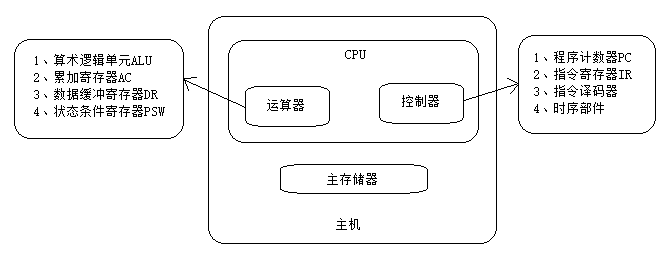

## 知识点归纳

知识点 | 分数 | 说明 | 比例 
:-: | :-: | :-: | :-: 
软件工程基础知识 | 11 | 开发模型、设计原则、测试方法、质量特性、CMM、Pert图、风险管理 | 14.67% 
面向对象 | 12 | 面向对象基本概念、面向对象分析与设计、UML、设计模式 | 16.00% 
数据结构与算法 | 10 | 数组、栈、队列、树与二叉树、图、查找与排序、常见算法 | 13.33%  
程序设计语言 | 6 | 文法、有限自动机、正规式、语句的作用、语句的语义、程序的控制结构、函数调用的参数传递、各种程序语言的特点比较 | 8.00% 
计算机硬件基础 | 6 | 浮点数运算、溢出、算术、逻辑运算、计算机体系结构分类、指令系统基础、CISC与RISC、流水线、Cache存储器可靠性分析、校验方法 | 8.00% 
操作系统 | 6 | 进程状态转换图、信号量与PV操作、死锁问题、银行家算法、段页式存储、页面置换算法、硬盘调度、树形文件系统 | 8.00% 
数据库系统 | 6 | E-R模型、关系代数、元祖运算、规范化理论（键、范式、模式分解）、并发控制 | 8.00% 
计算机网络 | 5 | OSI模型、TCP/IP协议族、子网划分、常见的网络命令 | 6.67% 
信息安全知识 | 3 | 加密解密技术、网络完全、计算机病毒 | 4.00% 
多媒体基础 | 3 | 多媒体基本概念、计算声音、图像、视频文件的容量、JPEG、MPEG | 4.00% 
知识产权与标准化 | 2 | 作品保护时间、侵权判定、知识产权归属、标准的分类、标准代号 | 2.67% 

## 计算机组成与体系结构

### 数据的表示

- R进制转十进制使用按权展开法

例如二进制10100.01 = 1x24+1x22+1x2-2

- 十进制转R进制使用短除法

例如51/2=25余1,25/2=12余1,12/2=6余0,6/2=3余0,3/2=1余1,1/2=0余1，
十进制51转换为二进制为110011

- 冯-诺依曼计算机体系架构没办法直接做减法，减法是通过加法来实现的。原码、反码、补码的产生过程，就是为了解决计算机做减法和引入符号位（正号和负号）的问题。
- 原码：是最简单的机器数表示法。用最高为表示符号位，'1'表示负号，'0'表示正号。其他位存放该数的二进制的绝对值。
- 反码：是为解决原码的正数与负数相加运算bug问题。正数的反码还是等于原码，负数的反码就是他的原码除符号位外，按位取反。
- 补码：是真正解决负数运算问题。正数的补码等于他的原码，负数的补码等于他的原码自低位向高位，尾数的第一个'1'及其右边的'0'保持不变，左边的各位按位取反，符号位不变。
- 浮点数运算。表示方法：N = M*Re，其中M称为尾数，e是指数，R是基数。浮点数运算流程：对阶-->尾数计算-->结果格式化。

### 计算机结构

- 基本的计算机结构如下图：

- Flynn根据指令流和数据流的不同组织方式，把计算机系统的结构分为以下四类：

体系结构类型 | 结构 | 关键特性 | 代表 
:-: | :-: | :-: | :-: 
单指令流单数据流SISD | 控制部分：一个 处理器：一个 主存模块：一个 |   | 单处理器系统 
单指令流多数据流SIMD | 控制部分：一个 处理器：多个 主存模块：多个 | 各处理器以异步的形式执行同一条指令 | 并行处理机 阵列处理机 超级向量处理机 
多指令流单数据流MISD | 控制部分：多个 处理器：一个 主存模块：多个 | 被证明不可能，至少不实际 | 目前没有，有文献称流水线计算机为此类 
多指令流多数据流MIMD | 控制部分：多个 处理器：多个 主存模块：多个 | 能够实现作业、任务、指令等各级全面并行 | 多处理机系统 多计算机 

- 
