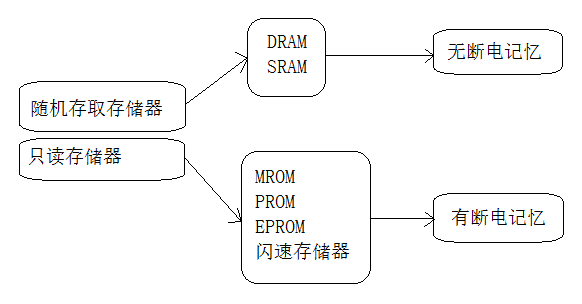
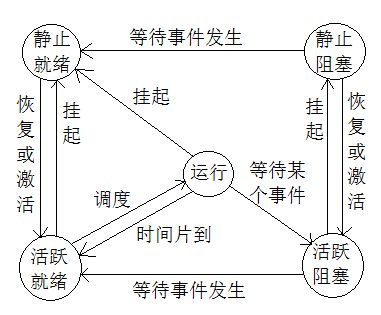
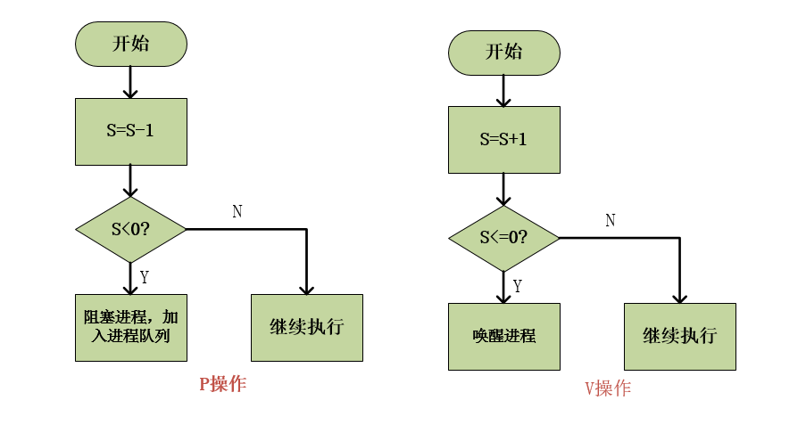
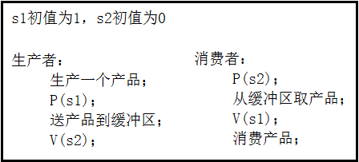
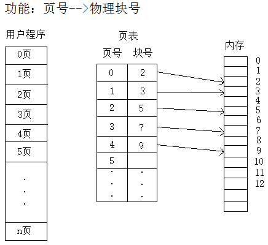
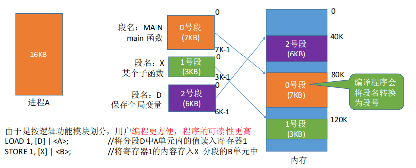
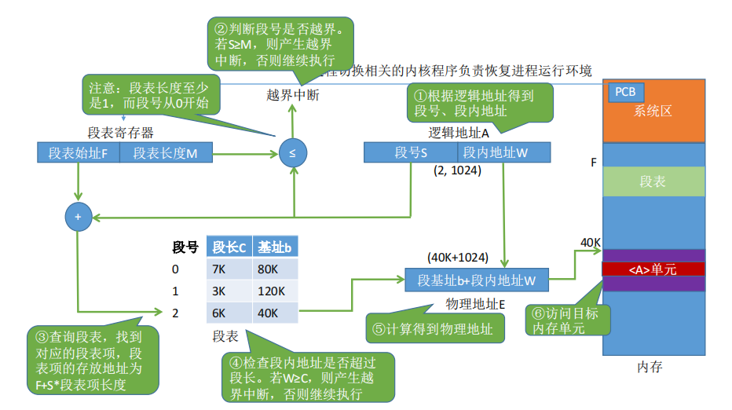
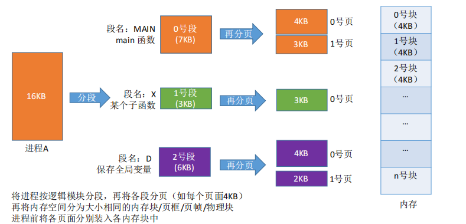
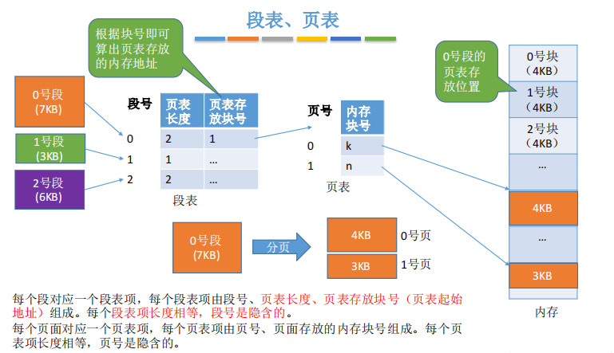
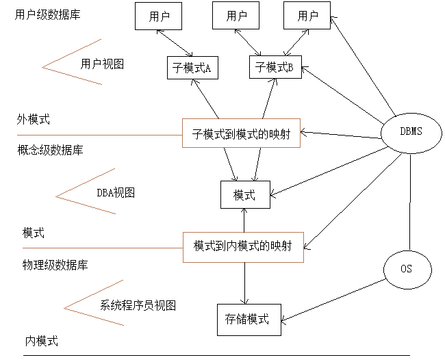

## 知识点归纳

知识点 | 分数 | 说明 | 比例 
:-: | :-: | :-: | :-: 
软件工程基础知识 | 11 | 开发模型、设计原则、测试方法、质量特性、CMM、Pert图、风险管理 | 14.67% 
面向对象 | 12 | 面向对象基本概念、面向对象分析与设计、UML、设计模式 | 16.00% 
数据结构与算法 | 10 | 数组、栈、队列、树与二叉树、图、查找与排序、常见算法 | 13.33%  
程序设计语言 | 6 | 文法、有限自动机、正规式、语句的作用、语句的语义、程序的控制结构、函数调用的参数传递、各种程序语言的特点比较 | 8.00% 
计算机硬件基础 | 6 | 浮点数运算、溢出、算术、逻辑运算、计算机体系结构分类、指令系统基础、CISC与RISC、流水线、Cache存储器可靠性分析、校验方法 | 8.00% 
操作系统 | 6 | 进程状态转换图、信号量与PV操作、死锁问题、银行家算法、段页式存储、页面置换算法、硬盘调度、树形文件系统 | 8.00% 
数据库系统 | 6 | E-R模型、关系代数、元祖运算、规范化理论（键、范式、模式分解）、并发控制 | 8.00% 
计算机网络 | 5 | OSI模型、TCP/IP协议族、子网划分、常见的网络命令 | 6.67% 
信息安全知识 | 3 | 加密解密技术、网络完全、计算机病毒 | 4.00% 
多媒体基础 | 3 | 多媒体基本概念、计算声音、图像、视频文件的容量、JPEG、MPEG | 4.00% 
知识产权与标准化 | 2 | 作品保护时间、侵权判定、知识产权归属、标准的分类、标准代号 | 2.67% 

## 计算机组成与体系结构

### 数据的表示

- R进制转十进制使用按权展开法

例如二进制10100.01 = 1x24+1x22+1x2-2

- 十进制转R进制使用短除法

例如51/2=25余1,25/2=12余1,12/2=6余0,6/2=3余0,3/2=1余1,1/2=0余1，
十进制51转换为二进制为110011

- 冯-诺依曼计算机体系架构没办法直接做减法，减法是通过加法来实现的。原码、反码、补码的产生过程，就是为了解决计算机做减法和引入符号位（正号和负号）的问题。
- 原码：是最简单的机器数表示法。用最高为表示符号位，'1'表示负号，'0'表示正号。其他位存放该数的二进制的绝对值。
- 反码：是为解决原码的正数与负数相加运算bug问题。正数的反码还是等于原码，负数的反码就是他的原码除符号位外，按位取反。
- 补码：是真正解决负数运算问题。正数的补码等于他的原码，负数的补码等于他的原码自低位向高位，尾数的第一个'1'及其右边的'0'保持不变，左边的各位按位取反，符号位不变。
- 浮点数运算。表示方法：N = M*Re，其中M称为尾数，e是指数，R是基数。浮点数运算流程：对阶-->尾数计算-->结果格式化。

### 计算机结构

- 基本的计算机结构如下图：

- Flynn根据指令流和数据流的不同组织方式，把计算机系统的结构分为以下四类：

体系结构类型 | 结构 | 关键特性 | 代表 
:-: | :-: | :-: | :-: 
单指令流单数据流SISD | 控制部分：一个 处理器：一个 主存模块：一个 |   | 单处理器系统 
单指令流多数据流SIMD | 控制部分：一个 处理器：多个 主存模块：多个 | 各处理器以异步的形式执行同一条指令 | 并行处理机 阵列处理机 超级向量处理机 
多指令流单数据流MISD | 控制部分：多个 处理器：一个 主存模块：多个 | 被证明不可能，至少不实际 | 目前没有，有文献称流水线计算机为此类 
多指令流多数据流MIMD | 控制部分：多个 处理器：多个 主存模块：多个 | 能够实现作业、任务、指令等各级全面并行 | 多处理机系统 多计算机 

- CISC与RISC：

指令系统类型 | 指令 | 寻址方式 | 实现方式 | 其它 
:-: | :-: | :-: | :-: | :-: 
CISC（复杂） | 数量多，使用频率差别大，可变长格式 | 支持多种 | 微程序控制技术（微码） | 研制周期长 
RISC（精简） | 数量少，使用频率接近，定长格式，大部分为单周期指令，操作寄存器，只有Load/Store操作内存 | 支持方式少 | 增加了通用寄存器，硬布线逻辑控制为主，适合采用流水线 | 优化编译，有效支持高级语言 

### 流水线

- 概念：流水线是指在程序执行时多条指令重叠进行操作的一种准并行处理实现技术。各种部件同时处理是针对不同指令而言的，它们可同时为多条指令的不同部分进行工作，以提高各部件的利用率和指令的平均执行速度。
- 流水线周期为执行时间最长的一段，流水线计算公式为：1条指令执行时间 + （指令条数-1）*流水线周期。理论公式：；实践公式：
- 流水线吞吐率：是指咋单位时间内流水线所完成的任务数量或输出的结果数量。计算流水线吞吐率的最基本的公式如下：

- 流水线最大吞吐率： 

- 流水线的加速比。完成同样一批任务，不使用流水线所用的时间与使用流水线所用的时间之比称为流水线的加速比。基本公式如下：

- 流水线的效率：是指流水线的设备利用率。在时空图上，流水线的效率定义为n个任务占用的时空区与k个流水段总的时空区之比。 流水线效率的计算公式：

### 层次化存储结构

- cache的功能：提高CPU数据输入输出的速率，突破冯-诺依曼瓶颈，即CPU与存储系统间数据传送带宽限制。在计算机的存储系统体系中，Cache是访问速度最快的层次。使用Cache改善系统性能的依据是程序的局部性原理。

### 磁盘结构与参数

- 磁盘存取时间 = 寻道时间+等待时间（平均定位时间+转动延迟）

注意：寻道时间是指磁头移动到磁道所需时间；等待时间为等待读写的扇区转到磁头下方所用的时间。

### 主存的分类

### 总线

- 根据总线所处的位置不同，总线通常被分成三种类型：

>内部总线：在CPU内部，寄存器之间和算术逻辑部件ALU与控制部件之间传输数据所用的总线。

>系统总线：又称内总线或板级总线，是微机中个插件板与系统板之间的总线，用于插件板一级的互联。因为该总线是用来连接微机各功能部件而构成一个完整微机系统的，所以称之为系统总线。
>>数据总线  
>>地址总线  
>>控制总线  

>外部总线：是计算机和外部设备之间的总线

### 系统可靠性分析与设计

- 可靠性R：指总它开始运行到某个时刻这段时间内能正常运行的概率。
- 失效率λ：指单位时间内失效的元件数与元件总数的比例。
- 串联系统：假设一个系统由N个子系统组成，当且仅当所有子系统都能正常工作时系统才能正常工作。  
可靠性计算：假设各个子系统的可靠性分别用R1R2...表示，则系统可靠性为：R = R1R2..Rn  
失效率计算：假设各个子系统的失效率分别用λ1λ2...表示，则系统失效率为：λ = λ1+λ2+...+λn
- 并联系统：假设一个系统由N个子系统组成，只要有一个子系统正常工作时系统就能正常工作。  
可靠性计算：假设各个子系统的可靠性分别用R1R2...表示，则系统可靠性为：R = 1-(1-R1)(1-R2)...(1-Rn)  
失效率计算：假设各个子系统的失效率用λ表示，则系统失效率为：

### 差错控制-CRC与海明校验码

- 码距：一个编码系统的码距是整个编码系统在红任意（所有）两个码字的最小距离。
- 循环校验码CRC：是数据通信领域中最常见的一种差错校验码，其特征是信息字段和校验字段的长度可以任意选定。通常用CRC校验工具来将数据进行对比，CRC校验工具一般分为CRC16和CRC32两种计算方式，所以CRC校验计算器也有两种。CRC校验码位数=生成多项式位数-1。CRC是一种数据传输检错功能，对数据进行多项式计算，并将得到的结果附在帧后面，接收设备也执行类似的算法，以保证数据传输的正确性和完整性。
- 海明校验码：被广泛采用的一种很有效的校验方法，是只要增加少数几个校验位，就能检测出二位同时出错、亦能检测出一位出错并能自动恢复该出错位的正确值的有效手段，后者被称为自动纠错。它的实现原理是在k个数据位之外加上r个校验位，从而形成一个k+r位的新的码字，使新的码字的码距均匀地拉大。把数据的每一个二进制位分配在几个不同的偶校验位的组合中，当某一位出错后，就会引起相关的几个校验位的值发生变化，这不但可以发现出错，还能指出是哪一位出错，为进一步自动纠错提供了依据。

- 海明校验码的位数r遵循条件：2r>=x+r+1，其中r为海明校验码位数，x为信息码位数。

## 操作系统基本原理

### 概述
- 管理系统的硬件、软件、数据资源
- 控制程序运行
- 人机之间的接口
- 应用软件与硬件之间的接口
- 操作系统的管理职能：进程管理、存储管理、文件管理、作业管理、设备管理

### 进程的状态

- PV操作：是一种实现进程互斥与同步的有效方法。PV操作与信号量的处理相关，P操作代表的是对资源的申请，V操作是释放资源的操作，流程图如下：

- 单缓冲区生产者、消费者问题PV原语描述：  
  
s1可以看做是代表一个缓冲位，s2可以看做是代表一个产品
- 进程管理是操作系统的核心，但如果设计不当，就会出现死锁的问题，如果一个进程在等待一件不可能发生的事情，则进程产生死锁，而如果一个或多个进程产生死锁，就会造成系统死锁。
- 死锁的避免：1、有序资源分配法，2、银行家算法

### 存储管理

- 连续存储分配算法：1、首次适应法，2、最佳适应法，3、最差适应法，4、循环首次适应法
- 页式存储（不连续存储）：就是把内存物理空间划分成大小相等的若干区域，一个区域称为一个块。把逻辑地址空间划分为大小相等的若干页，页大小与块大小相等。“页”是逻辑单位，“块”是物理单位。分配内存时，以块为单位将进程中的若干个页分别装入到多个可以不相邻的物理块中。
- 页式存储优点：利用率高，碎片小，分配与管理简单。
- 页式存储缺点：增加了系统开销；可能产生抖动现象。
- 页式存储地址结构：页号、页内地址（位移量）
  
页内地址的位数可以决定页的大小，逻辑地址=页号&位移量
- 地址映射（逻辑地址-->物理地址）：物理地址=块号&块内地址。因为块的大小=页的大小，所以块内位移量=页内位移量，所以只需求出块号即可。可通过页表求得块号：  

- 段式存储：是指把一个程序分成若干个段进行存储，每个段都是一个逻辑实体。段式管理是通过段表进行的，它包括段号或段名、段起点、装入点、段的长度等。内存空间为每个段分配一个连续的分区。段的长度由相应的逻辑信息组的长度决定，因而各段长度不等，引入分段存储管理方式的目的主要是为了满足用户在编程和使用上多方面的要求。

- 段式存储优点：多道程序共享内存，各段程序修改互不影响。
- 段式存储缺点：内存利用率低，内存碎片浪费大。
- 段式存储地址结构：段号、段内地址（位移量）
  
段号的位数决定了每个进程最多可以分几个段，段内地址的位数可以决定段的大小，逻辑地址=段号&段内地址。每个段对应一个段表项，其中记录了该段在内存中的其实位置（基址）和段的长度。
- 地址映射（逻辑地址-->物理地址）：物理地址=基址+段内地址，可通过段表求得基址：

- 段的保护：1、越界中断处理，进程在执行过程中，有时需要扩大分段，如数据段。由于要访问的地址超出原有的段长，所以发越界中断。操作系统处理中断时，首先判断该段的“扩充位”，如可扩充，则增加段的长度，否则按出错处理。2、缺段中断处理，检查内存中是否有足够的空闲空间，若有，则装入该段，修改有关数据结构，中断返回；若没有，检查内存中空闲区的总和是否满足要求，是则应采用紧缩技术，转1，否则。淘汰一些段，转1。
- 段的动态链接：大型程序由若干程序段，若干数据段组成，进程的某些程序段在运行期间可能根本不用，互斥执行的程序段没有必要同时驻留内存，有些程序段执行一次后不再用到，静态链接花费时间，浪费空间。在一个程序运行开始时，只将主程序段装配好并调入主存，其它各段的装配是在主程序段运行过程中逐步进行的。每当需要调用一个新段时，再将这个新段装配好，并与主程序段链接。
- 页式存储和段式存储对比：  
    1. 页式信息的物理单位。分页的主要目的是为了实现离散分配，提高内存利用率。分页仅仅是系统管理上的需要，完全是系统行为，对用户是不可见的。
    2. 段式信息的逻辑单位。分段的主要目的的更好地满足用户需求，一个段通常包含着一组属于一个逻辑模块的信息。分段是对用户可见的，用户编程时需要显式地给出字段名。
    3. 页的大小是固定且由系统决定。段的长度却不固定，决定于用户编写的程序。
    4. 分页的用户进程地址空间是一维的，程序员只需给出一个记忆符即可表示一个地址。
    5. 分段的用户进程地址空间是二维的，程序员在标识一个地址时，既要给出段名，也要给出段内地址。
    6. 分段比分页更容易实现信息的共享和保护。不能被修改的代码称为纯代码或可重入代码（不属于临街资源），这样的代码是可以共享的。可修改的代码是不能共享的。
    7. 访问一个逻辑地址需要几次访存？分页（单级分页）：第一次访存-->查内存中的页表，第二次访存-->访问目标内存单元。总共两次访存。分段：第一次访存-->查内存中的段表，第二次访存-->访问目标内存单元。总共两次访存。

- 段页式存储：用户程序先分段，每个段内部再分页（内部原理同基本的分页、分段相同）

- 段页式地址结构：段号、段内页号、页内地址（偏移量）。
  
段号的位数决定了每个进程最多可以分几个段，页号的位数决定了每个段最大有多少页，页内偏移量决定了页面大小、内存块大小是多少。“分段”对用户是可见的，程序员编程时需要显式地给出段号，段内地址。二将各段“分页”对用户是不可见的。系统会根据段内地址自动划分页号和页内便宜量。因此段页式管理的地址结构是二维的。
- 地址映射：逻辑地址-->段号、段内页号、页内地址，段表寄存器-->段表始址，段号+段内页号-->存储块号，块号+页内地址-->物理地址：

- 段页式存储地址转换原理：

- 段页式存储优点：保留了分段和请求分页存储管理的全部优点，提供了虚拟空间，能更有效利用主存。
- 段页式存储缺点：增加了硬件成本，系统复杂度较大。
- 快表：是一块小容量的相连存储器，由高速缓存器组成，速度快，并且可以从硬件上保证按内容并行查找，一般用来存放当前访问最频繁的少数活动页面的页号。
- 页式存储管理置换算法：进程运行时，若其访问的页面不在内存而需将其调入，但内存已无空闲空间时，就需要从内存中调出一页程序或数据，送入磁盘的对换区。选择调出页面的算法就称为页面置换算法。好的页面置换算法应有较低的页面更换频率，也就是说，应将以后不会再访问或者较长时间内不会再访问的页面先调出。
- 置换策略理论：
    1. 最佳置换算法（OPT）：最佳置换算法所选择的被淘汰页面是以后永不使用的，或者是在最长时间内不再被访问的页面，这样可以保证获得最低的缺页率。但由于人们目前无法预知进程在内存下的若干页面中哪个是未来最长时间内不再被访问的，因而该算法无法实现。
    2. 先进先出（FIFO）页面置换算法：优先淘汰最早进入内存的页面，亦即在内存中驻留时间最久的页面。改算法实现简单，只需把调入内存的页面根据先后次序链接成队列，设置一个指针总指向最早的页面。但该算法与进程实际运行时的规律不适应，因为在进程中，有的页面经常被访问。
    3. 最近最久未使用（LRU）置换算法：选择最近最长时间未被访问过的页面予以淘汰，它认为过去一段时间内未被访问过的页面，在最近的将来可能也不会被访问。该算法为每个页面设置一个访问字段，来记录页面自上次被访问以来所经历的时间，淘汰页面时选择现有页面中值最大的予以淘汰。
- 页面置换算法策略比较：
    1. 三种置换算法的优劣：
        - 优点：
            - FIFO页面置换算法实现简单，要求的硬件支持较少。
            - OPT页面置换算法可保证获得最低的缺页率，并且可以用来评价其他算法。
            - LRU页面置换算法利用“最近的过去”代替“最近的将来”，以此模拟OPT算法，是实际应用中缺页率最低的算法。
        - 缺点：
            - FIFO算法所依据的条件是各个页面调入内存的时间，而页面调入内存的先后并不能反映页面的使用情况。
            - OPT算法是理论上的算法，目前该算法是无法实现的。
            - LRU算法是根据各页以前的使用情况，来代替各页面将来的使用情况，进而判断要替换出去的页面，而页面过去和将来的走向之间并无必然的联系；其实际应用时要求较多的硬件支持，因而多采用近似算法。
    2. 在什么情况下采用哪种置换算法更有利？
        - FIFO算法在按线性顺序访问地址空间时使用；当硬件水平不足时，FIFO算法也可作为首选。
        - OPT算法可以进行模拟实验分析或理论分析。
        - 当系统由寄存器或栈的硬件支持时，利用LRU算法可以获得最低缺页率。
### 文件管理

- 索引文件结构

    大多数文件系统会以13个指针的形式来存储数据结构，间接的级别越多，访问的效率越低。
    1. 直接指向文件数据区块的10个指针，称为直接指针（direct pointer）。
    2. 一个单独非直接指针（singly indirect pointer），指向一个由多个指针构成的区块，后者的指针又指向文件数据区块。
    3. 一个双重非直接指针（doubly indirect pointer），指向一个由多个指针构成的区块，后者的指针又指向一个由多个指针构成的区块，这一区块的指针又指向文件数据的区块。
    4. 一个三重非直接指针（triply indirect pointer），指向一个由多个指针构成的区块，后者的指针又指向一个由多个指针构成的区块，其指针又指向另一个由多个指针构成的区块，这一区块的指针又指向文件数据的区块。

### 设备管理

- 数据传输控制方式

    1. 程序查询方式  
        程序查询方式是由CPU通过程序不断查询I/O设备是否已做好准备，从而控制I/O设备与主机交换信息。采用这种方式实现主机和I/O设备交换信息，要求I/O接口内设置一个能反映I/O设备是否准备就绪的状态标记，CPU通过对此标记的检测，可得知I/O设备的准备情况。
        - 优点：工作过程简单，不需要更多的硬件支持
        - 缺点：1、CPU和外围设备只能串行工作。2、CPU在一段时间内只能和一台外围设备交换数据信息，不能实现设备之间并行工作。3、程序直接控制方式只适用于那些CPU执行速度较慢，而且外围设备较少的系统。
    2. 程序中断方式
        1. 在I/O中断方式下，数据的输入按如下步骤操作
            1. 需要数据的进程通过CPU发出启动外设输入数据的指令，该指令同时置状态寄存器的中断允许位
            2. 在进程发出指令启动设备之后，该进程放弃处理机，等待输入完成。这时进程调度程序可以调度其他就绪进程占据处理机
            3. 当输入工作完成时，I/O控制器通过中断请求线向CPU发出中断信号。CPU在接收到中断信号之后，转去执行设备中断处理程序。设备中断处理程序把输入数据寄存器中的数据传送到相应的进程使用。同时把等待输入完成的那个进程唤醒，再返回到被中断的进程中执行
            4. 在以后的某个时刻，进程调度程序选中提出请求输入的进程，该进程从指定的内存单温中取出数据做进一步处理
        2. 中断控制方式的优缺点
            - 优点：与程序直接控制方式相比，中断方式使CPU的利用率大幅度提高了
            - 缺点：设备每输入/输出一个数据都要求中断CPU，这样在一次数据传送过程，中断发生次数较多，耗去大量CPU处理时间
    3. 直接存储器存取方式
        1. 介绍如下
            - 主存和DMA接口之间有一条数据通路，因此主存和设备交换信息时，不通过CPU，也不需要CPU暂停现行程序为设备服务，省去了保护现场和恢复现场，因此工作速度比程序中断方式的工作速度搞。这一特点特别适合于高速I/O或辅存与主存之间的信息交换。因为高速I/O设备若每次申请与主机交换信息时，都要等待CPU做出中断响应再进行，很可能因此使数据丢失。值得注意的是，若出现高速I/O（通过DMA接口）和CPU同时 访问主存，CPU必须将总线（如地址线，数据线）占有权让给DMA接口使用，即DMA采用周期窃取的方式占用一个存取周期。
            - 在DMA方式中，由于DMA接口与CPU共享主存，这就有可能出现两者争用主存的冲突。为了有效地分时使用主存，通常DMA与主存交换数据时采用如下三种方法。
                1. 停止CPU访问主存  
                当外设要求传送一批数据时，由DMA接口向CPU发一个停止信号，要求CPU放弃地址线、数据线和有关控制线的使用权。DMA接口获得总线控制权后，开始进行数据传送，在数据传送结束后，DMA接口通知CPU可以使用主存，并把总线控制权交回给CPU。  
                这种方式的优点是控制简单，适用于数据传输率很高的I/O设备实现成组数据的传送。缺点是DMA接口在访问主存时，CPU基本上处于不工作状态或保持原状态。而且即使I/O设备高速运行，两个数据之间的准备间隔时间也总大于一个存取周期，因此，CPU对主存的利用率并没得到充分的发挥。如软盘读一个8位二进制数大约需要32微秒，而半导体存储器的存取周期远小于1微秒，可见在软盘准备数据的时间内，主存处于空闲状态，而CPU又暂停访问主存。为此在DMA接口中，一般设有一个小容量存储器，使I/O设备首先与小容量存储器交换数据，然后由小容量存储器与主存交换数据，这便可减少DMA传送数据时占用总线的时间，即可减少CPU的暂停工作时间。
                2. 周期挪用（周期窃取）  
                在这种方法中，每当I/O设备发出DMA请求时，I/O设备便挪用或窃取总线占用权一个或几个主存周期，而DMA不请求时，CPU仍继续访问主存。  
                I/O设备请求DMA传送会遇到三种情况。一种是CPU此时不需要访问主存（如CPU正在执行乘法指令，由于乘法指令执行时间较长，此时CPU不需要访问主存），故I/O设备与CPU不发生冲突。第二种情况是I/O设备请求DMA传送时，CPU正在访问主存，此时必须待存取周期结束，CPU才能将总线占有权让出。第三种情况是I/O设备要求访问主存时，CPU也要求访问主存，这就出现了访问冲突。此刻，I/O访存优先于CPU访存，因为I/O不立即访问主存就可能丢失数据，这时I/O要窃取一、二个存取周期，意味着CPU在执行访问主存指令过程中插入了DMA请求，并挪用了一、二个存取周期，使CPU延缓了一、二个存取周期再访问主存。  
                与CPU暂停访存的方式相比，这种方式既实现了I/O传送，又较好地发挥了主存与CPU的效率，是一种广泛采用的方法。  
                应该指出，I/O设备每挪用一个主存周期都要申请总线控制权、建立总线控制权和归还总线控制权。因此，尽管传送一个字对主存而言只占用一个主存周期，但对DMA接口而言，实质上要占2~5个主存周期（由逻辑线路的延迟特性而定）。因此周期挪用的方法比较适合于I/O设备的读/写周期大于主存周期的情况。
                3. DMA与CPU交替访问  
                这种方法适合于CPU的工作周期比主存存取周期长的情况。例如，CPU的工作周期为1.2微秒，主存的存取周期小于0.6微秒，那么可将一个CPU周期分为C1和C2两个分周期，其中C1专供DMA访存，C2专供CPU访存。  
                这种方式不需要总线使用权的申请、建立和归还过程，总线使用权是通过C1和C2分别控制的。CPU与DMA接口各自有独立的访存地址寄存器、数据寄存器和读/写信号。实际上总线变成了在C1和C2控制下的多路转换器，其总线控制权的转移几乎不需要什么时间，具有很高的DMA传送速率。在这种工作方式下，CPU既不停止主程序的运行也不进入等待状态，即完成了DMA的数据传送。当然其相应的硬件逻辑变得更为复杂。
        2. DMA方式的数据输入过程如下
            1. 当进程要求设备输入一批数据时，CPU将准备存放输入数据的内存起始地址以及要传送的字节数分别送入DMA控制器中的内存地址寄存器和传送字节计数器，准备开始进行数据输入并且允许中断
            2. 发出数据要求的进程进入等待状态，进程调度程序调度其它进程占据CPU
            3. 输入设备不断的挪用CPU工作周期，将数据寄存器中的数据源源不断的写入内存，直到所要求的字节全部传送完毕
            4. DMA控制器在完成数据传送后通过中断请求线发出中断信号，CPU收到中断信号后转到中断处理程序，唤醒等待输入完成的进程，并返回被中断程序
            5. 中断处理结束后，CPU返回被中断的进程或去运行重新被调度的进程
        3. DMA方式与中断方式的主要区别
            1. 前者在全部数据传送结束时才中断CPU，后者每传送一个数据中断一次CPU
            2. 中断方式的数据传送在中断处理时由CPU控制完成，而DMA方式则是在DMA控制器的控制下完成
    4. 通道控制方式
    - 通道是专门用来输入和输出的处理机，它控制内存和设备直接进行数据交换
    - 按信息交换方式，可以把通道分为：1、字节多路通道；2、选择通道；3、数组多路通路
    - 通道指令一般包含有数据在内存中的地址、传送方向、数据块长度以及I/O设备的地址信息、特征信息（是磁带还是磁盘设备）等
    - 通道控制方式的数据输入过程如下
        1. 当进程要求输入数据时，CPU发出启动指令指明I/O操作、设备号和对应通道
        2. 对应通道接收到CPU发来的启动指令之后，把通道指令程序读出，并执行通道程序
        3. 如果数据传送结束，就向CPU发出中断请求。CPU收到中断信号后转向中断处理程序，唤醒等待输入完成的进程，并返回被中断程序
        4. 在以后的某个时刻，进程调度程序选中提出请求输入的进程，改进程从指定的内存起始地址取出数据，做进一步处理
- 输入输出系统的组成
    - 输入输出系统由I/O软件和I/o硬件两部分组成
        - I/O软件  
        输入输出系统软件的主要任务如下：
        1. 将用户编制的程序（或数据）输入主机内
        2. 将运算结果输送给用户
        3. 实现输入输出系统与主机工作的协调等
        - I/O硬件
        输入输出系统的硬件组成是多种多样的，在带有接口的I/O系统中，一般包括接口模块及I/O设备两大部分。
- 微内核操作系统
    类别 | 实质 | 优点 | 缺点 
    :-: | :-: | :-: | :-: 
    单体内核（宏内核） | 将图形、设备驱动及文件系统等功能全部在内核中实现，运行在内核状态和同一地址空间 | 减少进程间通信和状态切换的系统开销，获得较高的运行效率 | 内核庞大，占用资源较多且不易剪裁。系统稳定性和安全性不好
    微内核 | 只实现基本功能，将图形系统、文件系统、设备驱动及通信功能放在内核之外 | 内核精炼，便于剪裁和移植。系统服务程序运行在用户地址空间，系统的可靠性、稳定性和安全性较高。可用于分布式系统 | 用户状态和内核状态需要频繁切换，从而导致系统效率不如单体内核
- 用户态和内核态的理解和区别
    1. linux进程有4GB地址空间，如下图所示
          
        3G-4G大部分是共享的，是内核态的地址空间。这里存放整个内核的代码和所有的内核模块以及内核所维护的数据。
    2. 特权级的概念  
        对于任何操作系统来说，创建一个进程是核心功能。创建进程要做很多工作，会消耗很多物理资源。比如分配物理内存，父子进程拷贝信息，拷贝设置页目录页表等等，这些工作得由特定的进程去做，所以就有了特权级别的概念。最关键的工作必须交给特权级最高的进程去执行，这样可以做到集中管理，减少有限资源的访问和使用冲突。
    3. 用户态和内核态的概念  
        当一个进程在执行用户自己的代码时处于用户运行态（用户态），此时特权级最低，是普通的用户进程运行的特权级，大部分用户直接面对得程序都是运行在用户态。Ring3状态不能访问Ring0的地址空间，包括代码和数据；当一个进程因为系统调用陷入内核代码中执行时处于内核运行态（内核态），此时特权级最高，为0级。执行的内核代码会使用当前进程的内核栈，每个进程都有自己的内核栈。  
        用户运行一个程序，该程序创建的进程开始时运行自己的代码，处于用户态。如果要执行文件操作、网络数据发送等操作必须通过write、send等系统调用，这些系统调用会调用内核的代码。进程会切换到Ring0，然后进入3G-4G中的内核地址空间去执行内核代码来完成相应的操作。内核态的进程执行完成后又切换到用户态。这样，用户态的程序就不能随意操作内核地址空间，具有一定的安全保护作用。这说的保护模式是指通过内存页表操作等机制，保证进程间的地址空间不会互相冲突，一个进程的操作不会修改另一个进程地址空间的数据。
    4. 用户态和内核态的切换  
        当在系统中执行一个程序时，大部分时间是运行在用户态下的，在其需要操作系统帮助完成一些用户态自己没有特权和能力完成的操作时就会切换到内核态。  
        用户态切换内核态的3种方式  
        1. 系统调用：这是用户态进程主动要求切换到内核态的一种方式。用户态进程通过系统调用申请使用操作系统提供的服务程序完成工作。
        2. 异常：当CPU在执行运行在用户态下的程序时，发生了一些没有预知的异常，这时会触发由当前运行进程切换到处理此异常的内核相关进程中，也就是切换到内核态。
        3. 外围设备的中断：当外围设备完成用户请求的操作后，会向CPU发出相应的中断信号，这时CPU会暂停执行下一条即将要执行的指令而转到与中断信号对应的处理程序去执行，如果前面执行的指令时用户态下的程序，那么转换的过程自然就会是由用户态到内核态的切换。
    5. 用户态到内核态具体的切换步骤
        1. 从当前进程的描述符中提取其内核栈的ss0及esp0信息
        2. 使用ss0和esp0指向的内核栈将当前进程的cs，eip，eflags，ss，esp信息保存起来，这个过程也完成了由用户栈到内核栈的切换过程，同时保存了被暂停执行的程序的下一条指令
        3. 将先前由中断向量检索得到的中断处理程序的cs，eip信息装入相应的寄存器，开始执行中断处理程序，这是就转到了内核态的程序执行了

## 数据库系统

### 数据库模式

- 数据库的设计
    1. 需求分析  
    首先应分析现实需求，即做需求分析，需求分析的任务就是通过调查、访谈、讨论、分析用户的业务流程，从而得出用户的需求，并用数据流程图、数据字典将用户需求描述出来
    2. 数据库概念设计  
    在需求分析的基础上，进行数据库概念设计，这种设计与具体的数据库管理系统无关，其任务是抽象出各用户所要求的的数据视图（对应于外模式概念），最后总和为全局的数据视图（对应于模式概念），用概念数据模型来抽象，可用ER模型或对象模型。
    3. 数据库逻辑设计  
    将用ER模型或对象模型表示的数据视图，转换为关系模式，并对所得关系模式进行优化处理，这就是所谓的数据库逻辑设计（这一步仍然对应于外模式和模式）
    4. 数据库的物理设计  
    在逻辑设计的基础上，将所得的数据模式组织存储到物理介质上，这就是数据库的物理设计（这一步对应于内模式）
    5. 数据库的安全设计  
    即允许什么样的用户访问数据库，以及合法用户访问数据库中数据的权限等问题
- 三级模式和两级映射
    - 美国家标准协会的数据库管理系统研究小组将数据库结构分为3级：面向用户的用户级、面向建立和维护数据库人员的概念级、面向系统程序员的物理级。用户级对应外模式，概念级对应模式，物理级对应内模式，使不同级别的用户对数据库形成不用的视图。所谓视图，就是指观察、认识和理解数据的范围、角度和方法，是数据库在用户“眼中”的反映，很显然，不同层次（级别）用户所“看到”的数据库是不相同的。
    - 模式
        模式又称概念模式或逻辑模式，对应概念级。它是由数据库设计者总和所有用户的数据，按照统一的观点构造的全局逻辑结构，是对数据库中全乎数据的逻辑结构和特征的总体描述，是所有用户的公共数据视图。它是由数据库管理系统提供的数据模式描述语言来描述、定义的、体现、反映了数据库系统的整体观。理解如下：
        - 一个数据库只有一个模式
        - 是数据库数据在逻辑级上的视图
        - 数据库模式以某一种数据模型为基础
        - 定义模式时不仅要定义数据的逻辑结构（如数据记录由哪些数据项构成，数据项的名字、类型、取值范围等），而且要定义与数据有关的安全性、完整性要求，定义这些数据之间的联系
    - 外模式
        外模式又称子模式、对应于用户级。它是某个或某几个用户所看到的数据库的数据视图，是与某一应用有关的数据的逻辑表示。外模式是从模式导出的一个子集，包含模式中允许特定用户使用的那部分数据。用户可以通过外模式描述语言来描述、定义对应于用户的数据记录（外模式），也可以利用数据操纵语言对这些数据记录进程处理。外模式反映了数据库的用户观。理解如下：
        - 一个数据库可以有多个外模式
        - 外模式就是用户视图
        - 外模式是保证数据安全性的一个有力措施
    - 内模式
        内模式又称存储模式，对应于物理级，它是数据库中全体数据的内部表示或底层描述，它描述了数据在存储介质上的存储方式及物理结构（顺序存储、按照B树结构存储还是hash方法存储），对应着实际存储在外存储介质上的数据库。内模式由内模式描述语言来描述、定义，它是数据库的存储观。理解如下：
        - 一个数据库只有一个内模式
        - 一个表可能由多个文件组成，如：数据文件、索引文件
    - 两级映射
        从下图中可以看到用户应用视图根据外模式进行数据操作，通过外模式-模式映射，定义和建立某个外模式与模式之间的对应关系，将外模式与模式联系起来，当模式发生改变时，只要改变其映射，就可以使外模式保持不变，对应的应用程序也可以保持不变；另一方面，通过模式-内模式映射，定义建立数据的逻辑结构与存储结构间的对应关系，当数据的存储结构发生变化时，只需改变模式-内模式映射，就能保持模式不变，因此应用程序也可以保持不变。通过外模式-模式映射和模式-内模式映射这两个映射保证了数据库系统中的数据具有较高的逻辑独立性和物理独立性。
    

### ER模型
### 关系代数与元组演算
### 规范化理论
### 并发控制
### 数据库完整性约束
### 分布式数据库
### 数据仓库与数据挖掘